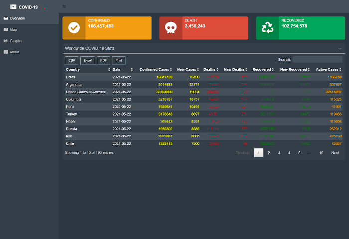
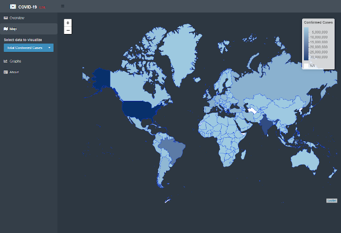
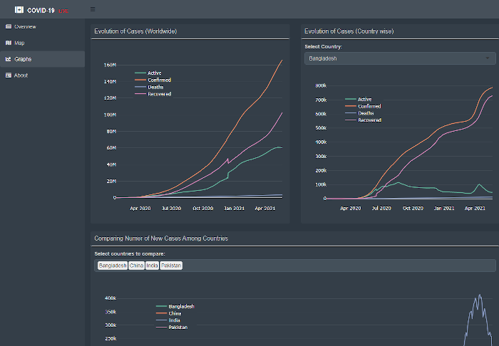

# Covid19 Dahsboard

This is a dashboard develpoed with R programming language and Shiny framework. It can help someone to get an idea about the Corona virus situation worldwide at a glance. You can see a live version of the dashboard <a href="https://shiny.wahidkhan.me/covid19">here</a>.

## Data source
All data for this dashboard are from the official github repository of the Center for Systems Science and Engineering (CSSE) at Johns Hopkins University.
<a href="https://github.com/CSSEGISandData">Click here to go to the repository</a>.